# Preview/Output to all the projects in this repository (except "Practice")

## 1. Animated Action Menu

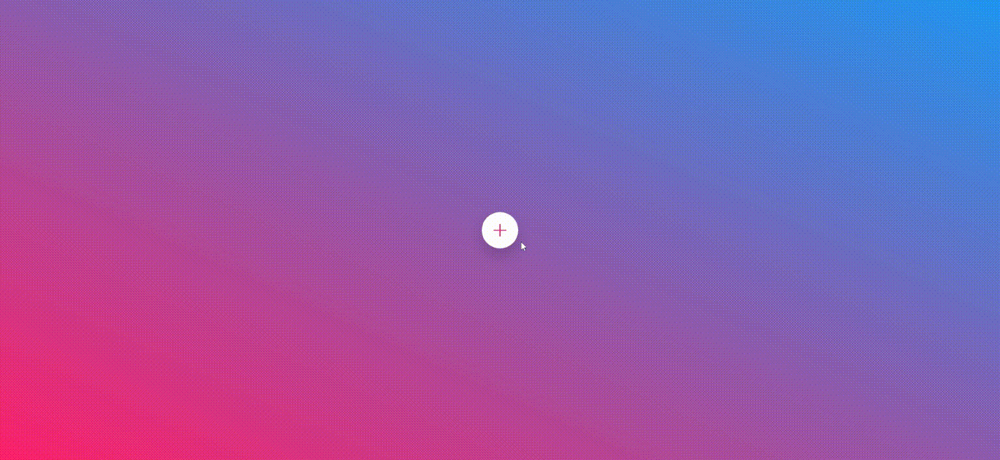

## 2. Claymorphism Menu Bar

## 3. Glassmorphism Circular Progress Bar

## 4. Glowing Neumorphic Gradient Loading

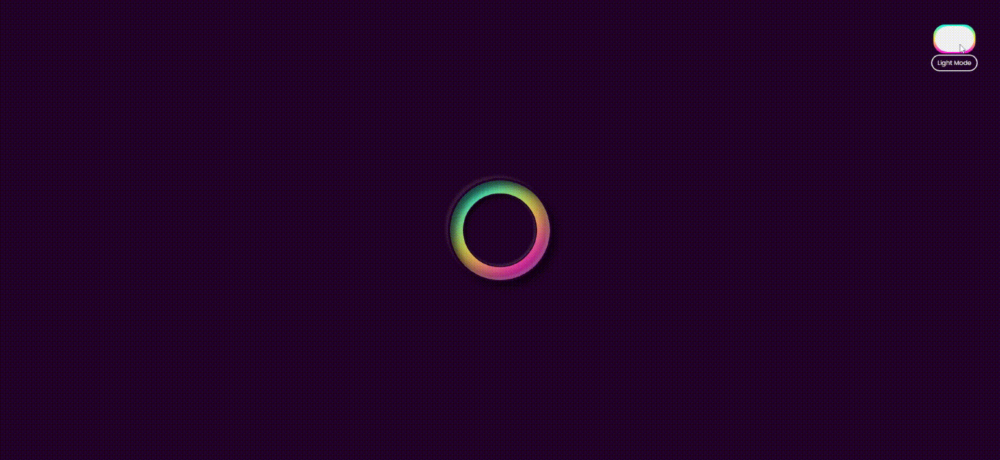

## 5. Glowing Anchor-Buttons

#### 5.a

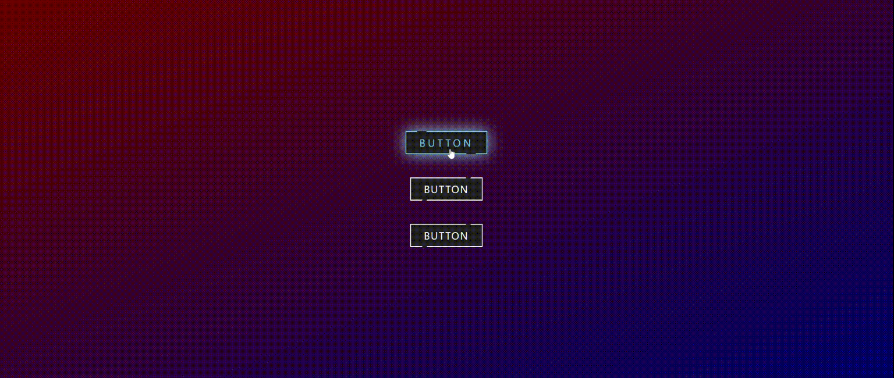

#### 5.b

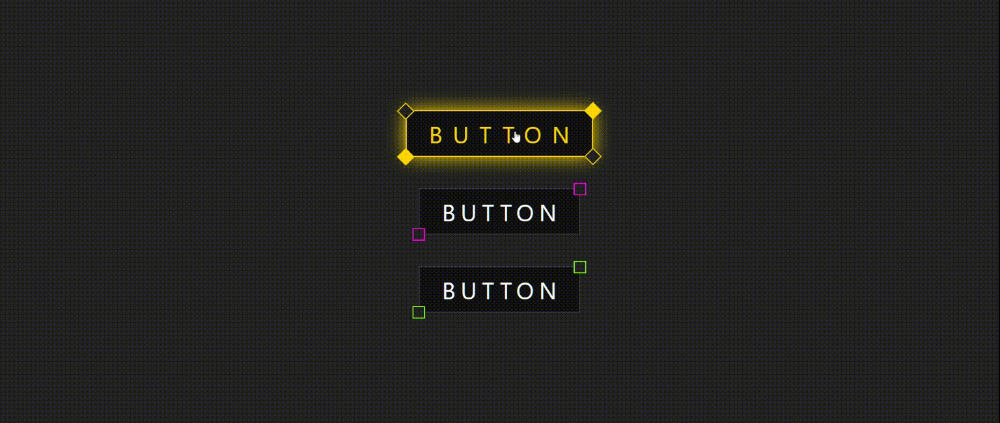

## 6. Glow Clock

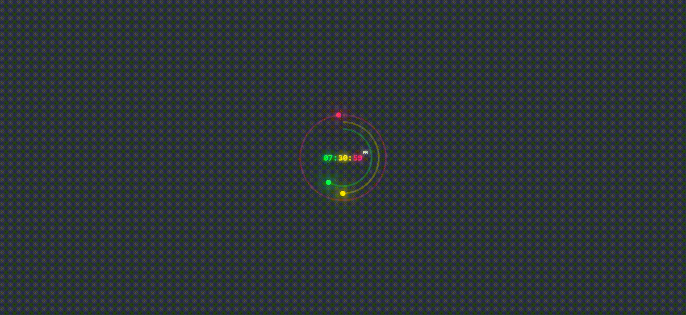

## 7. Isometric Menu

## 8. Animated Gradient Loading Bar

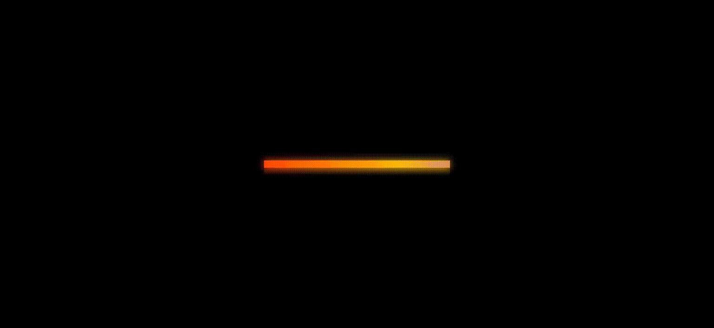

## 9. Neumorphic Clock

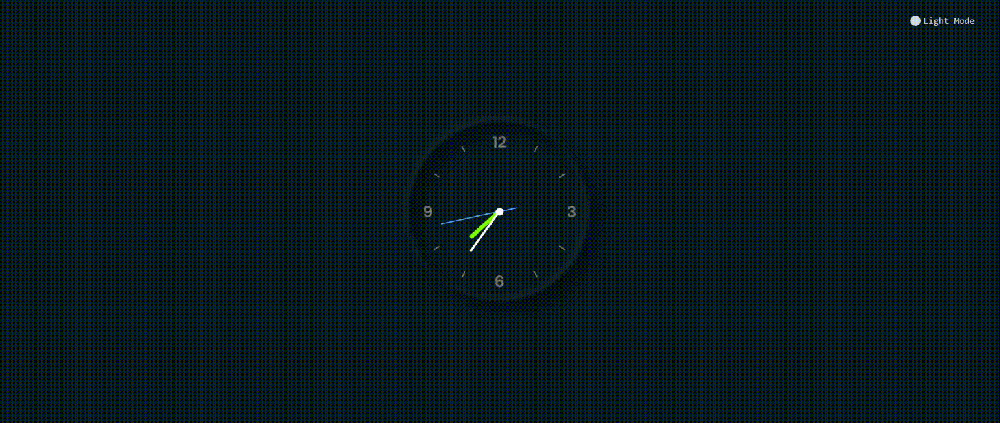

## 10. Neumorphic Dynamic Calendar

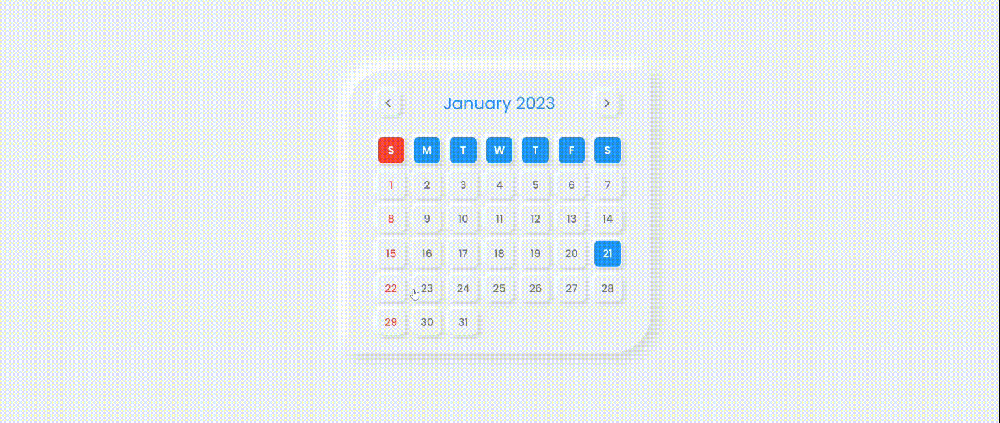

## 11. Neumorphic Range Slider

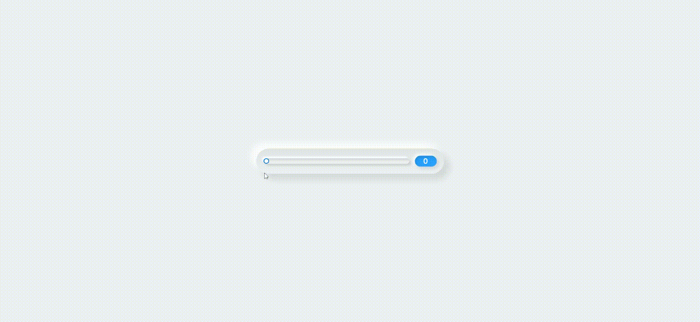

## 12. Neumorphic Music Player

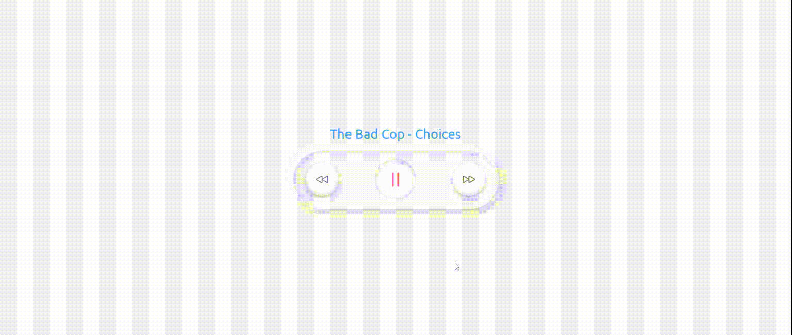

## 13. Product Cards

#### 13.a

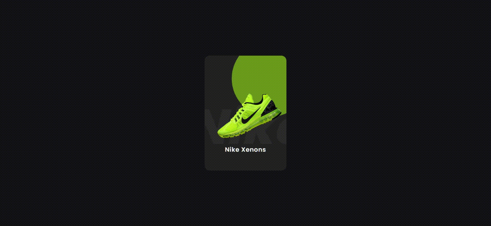

#### 13.b

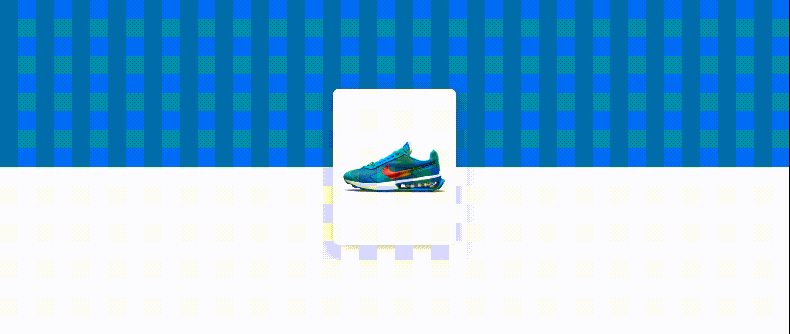

## 14. Reflective Glow Loading Ring

