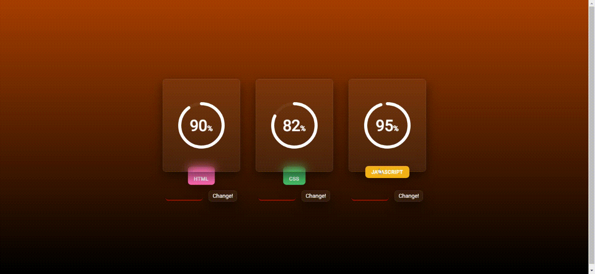

# Preview/Output to all the projects in this repository (except "Practice")

## 1. Animated Action Menu

## 2. Claymorphism Menu Bar

## 3. Glassmorphism Circular Progress Bar

## 4. Glowing Neumorphic Gradient Loading

## 5. Glowing Anchor-Buttons

#### 5.a

#### 5.b

## 6. Glow Clock

## 7. Isometric Menu

## 8. Animated Gradient Loading Bar

## 9. Neumorphic Clock

## 10. Neumorphic Dynamic Calendar

## 11. Neumorphic Range Slider

## 12. Neumorphic Music Player

## 13. Product Cards

#### 13.a

#### 13.b

## 14. Reflective Glow Loading Ring

